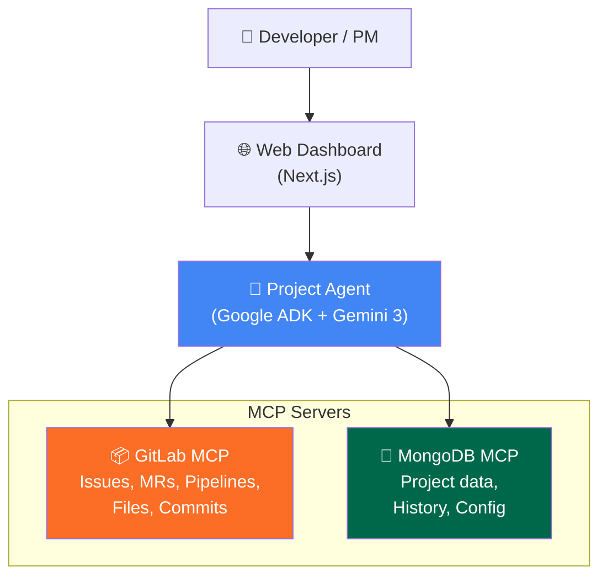

# Project Agent — "Jira Records, We Execute"

Build an AI agent that replaces static project management tools with an intelligent system that **automatically syncs status from GitLab, generates standup reports, aggregates context, and plans sprints** — all powered by Gemini 3 and MCP.

## User Review Required

> [!IMPORTANT]
> **Track Decision**: The rules state you cannot use competing services. Choose ONE:
> - **GitLab Track** — Use GitLab MCP as the primary partner integration (recommended, strongest fit)
> - **MongoDB Track** — Use MongoDB MCP as primary (would need to reframe as "knowledge/data agent")
> 
> **Recommendation**: Submit to **GitLab Track**. GitLab MCP provides the richest tool surface for this project (issues, MRs, pipelines, files). MongoDB can still be used as a supplementary database — just make GitLab the "featured" partner.

> [!WARNING]
> **AI Limitation Rule**: "All other artificial intelligence tools are not permitted" — Only Google Cloud AI (Gemini) and partner's built-in AI are allowed. No OpenAI, Anthropic, Hugging Face models, etc.

## Open Questions

1. Do you have a **GitLab account** with existing projects? (We need real repos for the demo)
2. Do you have a **Google Cloud account**? ($100 free credits available via [this form](https://forms.gle/xfv9vQzfRfNCCVbG7) — apply by June 4th)
3. Team size — solo or with others?
4. Preferred frontend: **Web app** (Next.js) or **CLI-first** with simple web dashboard?

---

## Architecture



### Tech Stack

| Layer | Technology | Purpose |
|-------|-----------|---------|
| **AI Brain** | Gemini 2.5 Flash (via ADK) | Reasoning, planning, NL understanding |
| **Agent Framework** | Google ADK (Python) | Agent orchestration, tool management |
| **Partner MCP** | GitLab MCP (`@modelcontextprotocol/server-gitlab`) | Issues, MRs, pipelines, code access |
| **Database** | MongoDB Atlas (via MCP) | Project config, history, standup logs |
| **Frontend** | Next.js + React | Web dashboard |
| **Hosting** | Google Cloud Run | Production deployment |

---

## Proposed Changes

### Core Agent (Python + ADK)

#### [NEW] `agent/main.py` — Agent entry point
- Initialize ADK agent with Gemini 2.5 Flash
- Connect GitLab MCP + MongoDB MCP via `MCPToolset`
- Define agent instruction/persona

#### [NEW] `agent/tools/sync_tools.py` — Status sync tools
- `sync_project_status()` — Scan recent GitLab MRs & pipelines → update MongoDB project state
- `detect_blockers()` — Identify blocked items (failed CI, stale MRs, unresolved discussions)

#### [NEW] `agent/tools/standup_tools.py` — Standup generation tools
- `generate_standup_report(project_id, date_range)` — Pull GitLab activity → format as standup
- `get_team_activity(project_id)` — Aggregate commits, MRs, reviews per team member

#### [NEW] `agent/tools/context_tools.py` — Context aggregation tools
- `get_issue_full_context(issue_id)` — Aggregate: issue details + related MRs + CI status + code changes + discussions
- `search_project_knowledge(query)` — Semantic search across project docs/READMEs

#### [NEW] `agent/tools/sprint_tools.py` — Sprint planning tools
- `analyze_backlog(project_id)` — Categorize & prioritize issues
- `estimate_effort(issue_id)` — AI-based effort estimation from issue description + code complexity
- `suggest_sprint_plan(capacity, priorities)` — Generate sprint plan with dependency ordering

---

### 4 Core Agent Capabilities (Demo Flow)

#### Capability 1: Auto Status Sync
```
User: "Sync the status of project frontend-app"
Agent:
  1. GitLab MCP → list open MRs → check pipeline status
  2. GitLab MCP → list recent commits → identify active work
  3. GitLab MCP → list issues → check which have linked MRs
  4. MongoDB → update project state document
  5. Return: "3 MRs open (1 passing, 2 failing), 5 issues in progress, 2 blocked by CI"
```

#### Capability 2: Smart Standup Report
```
User: "Generate standup report for today"
Agent:
  1. GitLab MCP → get all commits since yesterday
  2. GitLab MCP → get all MR activity (opened, merged, commented)
  3. GitLab MCP → get pipeline results
  4. Gemini → synthesize into structured report per person
  5. Return formatted standup with: Done / In Progress / Blocked
```

#### Capability 3: Issue Deep Context
```
User: "What's the full story on issue #42?"
Agent:
  1. GitLab MCP → get issue #42 details + discussions
  2. GitLab MCP → find linked MRs → get diffs
  3. GitLab MCP → check pipeline status of linked MRs
  4. MongoDB → check historical context
  5. Gemini → synthesize complete narrative
  6. Return: timeline, code changes, current status, blockers, suggested next steps
```

#### Capability 4: Sprint Planning Assistant
```
User: "Help me plan next sprint, we have 3 developers for 2 weeks"
Agent:
  1. GitLab MCP → get all open issues with labels/milestones
  2. Gemini → estimate complexity from issue descriptions
  3. Gemini → identify dependencies between issues
  4. Gemini → generate sprint plan respecting capacity & priorities
  5. MongoDB → save sprint plan
  6. Return: ordered list of issues per developer + risk assessment
```

---

### Web Frontend (Next.js)

#### [NEW] `web/` — Next.js app

| Page | Purpose |
|------|---------|
| **Dashboard** | Project health overview — open MRs, CI status, blocker count |
| **Standup** | Today's auto-generated standup report |
| **Issue Explorer** | Deep-dive into any issue with AI context |
| **Sprint Planner** | Interactive sprint planning with AI suggestions |
| **Chat** | Free-form conversation with the agent |

> [!TIP]
> The web frontend is **secondary** — the agent itself is the star. A clean, minimal dashboard that shows the agent working is better than a complex UI. Focus 70% effort on agent quality, 30% on frontend.

---

### Project Structure

```
project-agent/
├── agent/                    # Google ADK Agent (Python)
│   ├── __init__.py
│   ├── main.py              # Agent definition + MCP connections
│   ├── tools/
│   │   ├── sync_tools.py    # Status sync capabilities
│   │   ├── standup_tools.py # Standup generation
│   │   ├── context_tools.py # Issue context aggregation
│   │   └── sprint_tools.py  # Sprint planning
│   └── prompts/
│       └── system.py        # Agent system prompt
├── web/                      # Next.js Frontend
│   ├── app/
│   │   ├── page.tsx         # Dashboard
│   │   ├── standup/
│   │   ├── issues/
│   │   ├── sprint/
│   │   └── chat/
│   ├── components/
│   └── lib/
│       └── api.ts           # Agent API client
├── .env.example              # Required env vars
├── README.md                 # Setup & usage docs
├── LICENSE                   # MIT License (required!)
├── requirements.txt          # Python deps
└── Dockerfile                # For Cloud Run deployment
```

---

## 16-Day Timeline

| Days | Phase | Deliverable |
|------|-------|-------------|
| **Day 1-2** (May 27-28) | **Setup & Skeleton** | ADK project scaffolded, GitLab MCP connected, "hello world" agent working |
| **Day 3-5** (May 29-31) | **Core Agent: Sync + Standup** | Capabilities 1 & 2 fully working — sync status, generate standup |
| **Day 6-8** (Jun 1-3) | **Core Agent: Context + Sprint** | Capabilities 3 & 4 working — issue context, sprint planning |
| **Day 9-11** (Jun 4-6) | **Web Frontend** | Dashboard, standup view, chat interface |
| **Day 12-13** (Jun 7-8) | **Integration + Polish** | End-to-end flow, error handling, edge cases |
| **Day 14** (Jun 9) | **Demo Video** | Record 3-min video showcasing all 4 capabilities |
| **Day 15** (Jun 10) | **Deploy + Docs** | Deploy to Cloud Run, write README, add LICENSE |
| **Day 16** (Jun 11) | **Submit** | Final Devpost submission before 2:00 PM PT |

> [!CAUTION]
> **Apply for $100 Google Cloud credits by June 4th!** [Form link](https://forms.gle/xfv9vQzfRfNCCVbG7)

---

## Judging Criteria Alignment

The 4 criteria are **equally weighted**:

| Criterion | How We Score High |
|-----------|-------------------|
| **Technological Implementation** | Deep GitLab MCP integration (uses 10+ MCP tools), clean ADK architecture, multi-step agent reasoning |
| **Design** | Polished web dashboard, intuitive UX, clear information hierarchy |
| **Potential Impact** | "Every dev team uses Jira/Linear and hates it" — massive addressable market |
| **Quality of the Idea** | "Project management that DOES the work, not just records it" — clear, bold differentiator |

---

## Submission Checklist

- [ ] Hosted project URL (Cloud Run)
- [ ] Public GitHub/GitLab repo with MIT LICENSE
- [ ] 3-minute demo video on YouTube (English)
- [ ] Devpost form: description, tech stack, learnings
- [ ] Select **GitLab Track**

---

## Verification Plan

### Automated Tests
- Unit tests for each tool function
- Integration test: agent completes a full sync workflow
- `adk web` — verify agent reasoning in ADK debug UI

### Manual Verification
- Demo with a real GitLab project (create a sample project with issues, MRs, pipelines)
- Record the agent performing all 4 core capabilities end-to-end
- Test edge cases: empty project, failed pipelines, no open issues

### Demo Script (3 minutes)
1. **(0:00-0:30)** — Problem statement: "Jira/Linear only records, never acts"
2. **(0:30-1:15)** — Capability 1+2: Sync project status → generate standup report
3. **(1:15-2:00)** — Capability 3: Deep-dive into a blocked issue → full context
4. **(2:00-2:45)** — Capability 4: "Plan my next sprint" → AI generates sprint plan
5. **(2:45-3:00)** — Architecture recap + call to action
